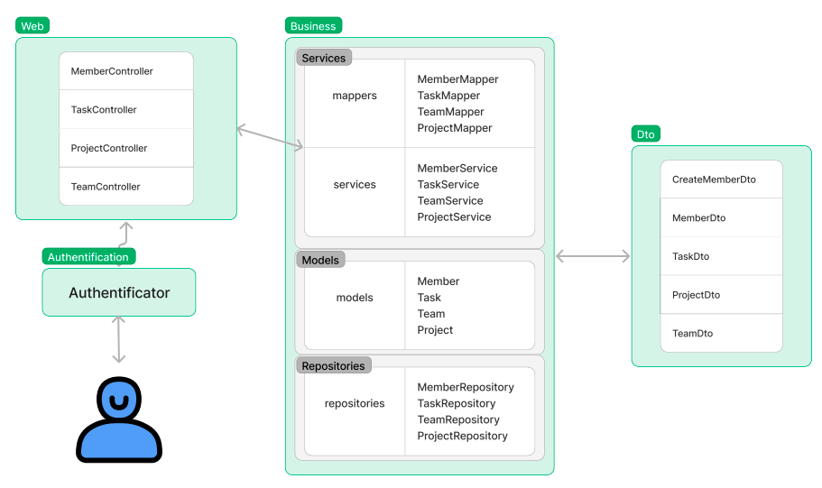

# Система управлениями проектами

### Описание модулей:

-------
* **web** предназначен для работы с пользователем, обработку ведет с помощью модуля services
-------
* **business** реализует бизнес логику: 
   + *models* отвечает за представление сущностей
   + *repositories* предоставляет методы для работы с конкретным типом, инкапсулирует в себе всё, что относится к способу хранения данных. Назначение: Разделение бизнес-логики от деталей реализации слоя доступа к данным.
   + *mapping* приведение DTO к типу и наоборот
   + *services* при помощи Mapping и Repository участвует в реализации бизнес логики
-------
* **dto** содержит все виды DTO для осуществления обмена данными между системами и базой данных
-------
* **auth** предназначен для аутентификации в системе
-------
* **app** инициализация проекта
-------

### Декомпозиция итоговой работы на блоки задач:
* Реализовать необходимые сущности проекта(Member, Task, Project, Team)
* Реализовать DTO связанные с определенными сущностями. Основная цель DTO — отделить различные уровни или компоненты, позволяя им взаимодействовать и обмениваться данными без необходимости знать детали реализации друг друга.
* Реализовать мапперы для сопоставления DTO сущностям
* Реализовать репозитории для хранения данных
* Реализовать сервисы, которые будут выполнять операции преобразования данных
* Реализовать контроллеры, которые будут обрабатывать запросы 